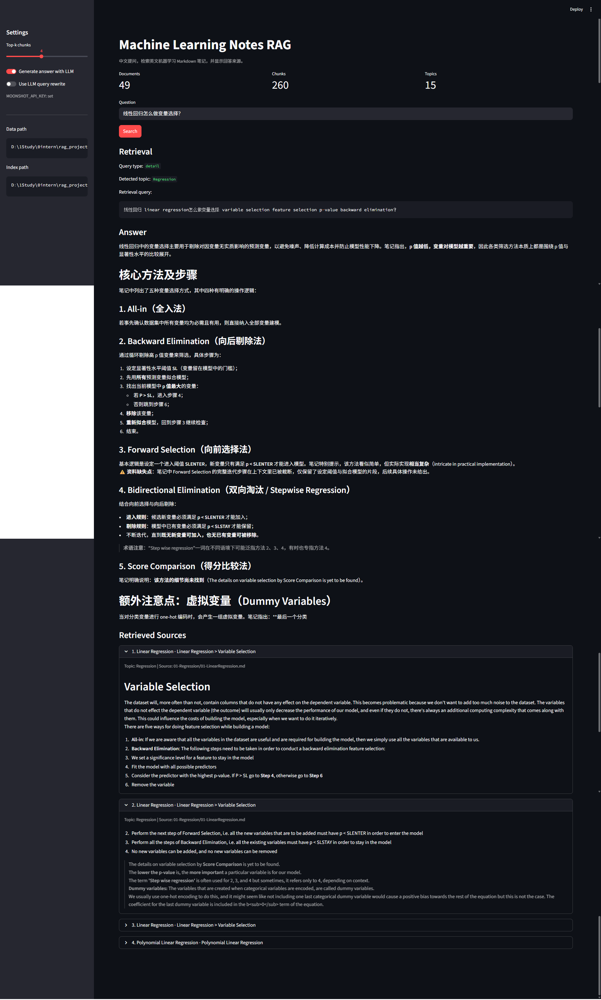
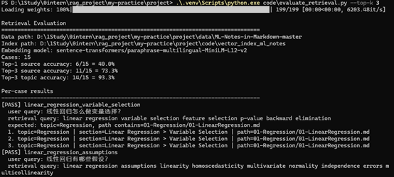

# Machine Learning Notes RAG

一个面向英文机器学习 Markdown 笔记的中文问答 RAG 系统。项目将 `data/ML-Notes-in-Markdown-master` 中的结构化 Markdown 笔记构建为可检索知识库，支持用户用中文提问，并基于检索到的英文笔记内容生成中文回答。

## Highlights

- 面向英文机器学习 Markdown 笔记构建中文问答系统，支持中文问题检索英文资料。
- 实现 Markdown 标题感知分块，并保留 `topic`、`chapter`、`title`、`section_path`、`chunk_id` 等元数据。
- 使用多语 HuggingFace embedding、FAISS 向量检索、BM25 关键词检索和 RRF 融合重排。
- 对明确的中文术语做确定性英文扩展；在线链路不再调用 LLM 做路由或 query rewrite。
- 对列表类问题使用 topic 元数据直接列出文档，避免中文 query 在英文语料上召回不全。
- 提供 Streamlit Web UI，展示回答、检索 query、source path 和 top-k chunks。
- 提供 FastAPI SSE 主入口 `/v1/chat/stream`、debug 接口、Redis exact cache、MySQL best-effort 查询记录，以及 JSONL 业务日志。
- 提供 50 条不调用 LLM 的离线检索评估集；它只衡量本地检索质量，不代表 FastAPI/Moonshot 端到端延迟。当前 35 条可索引 source case 的 Top-1 source accuracy 为 88.6%，Top-3 source accuracy 为 91.4%，Top-3 topic accuracy 为 94.3%。

## 项目目标

机器学习资料常以英文 Markdown、博客或课程笔记形式存在。中文使用者在查找概念、算法步骤、公式解释和注意事项时，通常需要跨语言检索，并且希望能追踪答案来源。

本项目的目标是构建一个小型但完整的 RAG 应用原型，重点关注：

- 如何把英文 Markdown 笔记转成可检索知识库。
- 如何支持中文问题检索英文内容。
- 如何把检索来源暴露给用户，降低生成式回答的不可验证性。
- 如何用离线评估脚本量化检索效果，而不是只依赖主观演示。
- 如何通过 API、错误处理和结构化日志提升 RAG 系统的可调用性与可观测性。

## 数据特点

数据目录：

```text
data/ML-Notes-in-Markdown-master
```

数据是英文机器学习笔记，主要特点：

- 以 Markdown 文件存储。
- 目录天然对应机器学习主题，例如 `Regression`、`Classification`、`Clustering`、`Deep Learning`。
- 文档内部包含多级标题、公式图片链接、列表和代码引用。
- 不同主题内容密度不均，有些目录只有很短的 README，有些主题包含多个算法文件。

## 数据来源与许可

本项目使用的机器学习 Markdown 笔记来自 `ML-Notes-in-Markdown`，原始作者为 Purnesh Tripathi。

该数据使用 MIT License：

- 允许使用、复制、修改和再分发。
- 允许用于个人项目、学习项目和公开 GitHub 仓库。
- 需要保留原始版权声明和 License 文本。

本项目保留了原始 License 文件：

```text
data/ML-Notes-in-Markdown-master/LICENSE
```

如果你重新整理或发布这个项目，请继续保留该 License 文件，并在 README 中说明数据来源。

## 系统架构

```text
Markdown files
    |
    v
DataPreparationModule
    - load *.md
    - extract title/topic/chapter/section metadata
    - split by Markdown headers
    - recursively split long chunks
    |
    v
IndexConstructionModule
    - multilingual HuggingFace embeddings
    - FAISS vector index
    |
    v
RetrievalOptimizationModule
    - FAISS semantic search
    - BM25 keyword search with title/path terms
    - stable-chunk-id RRF rerank
    - topic-first fallback
    |
    v
RAGService
    - rule-first query routing and term expansion
    - evidence gate before generation
    - Chinese answer generation
    |
    v
FastAPI / Streamlit UI / CLI
    - Redis exact cache
    - MySQL query logs and feedback
```

## 核心实现

### 1. Markdown 结构感知分块

项目不是直接按固定长度切分全文，而是先使用 Markdown 标题层级切分：

- `#`
- `##`
- `###`
- `####`

每个 chunk 会保留章节路径，例如：

```text
Linear Regression > Variable Selection
```

如果某个标题块过长，再使用递归字符切分，避免单个 chunk 过大导致召回或生成阶段上下文质量下降。

### 2. 主题元数据

系统从目录名中提取主题：

```text
01-Regression -> Regression
02-Classification -> Classification
03-Clustering -> Clustering
```

每个文档和 chunk 都会带有：

- `title`
- `topic`
- `chapter`
- `relative_path`
- `section_path`
- `parent_id`
- `chunk_id`

这些字段用于过滤、展示来源和回溯父文档。

### 3. 检索流程

系统的检索链路会根据问题类型走不同路径：

```text
user question
  -> rule-first router: list / detail / general
  -> topic detection: 从中文或英文问题中识别 Regression、Classification、Clustering 等主题
  -> retrieval query:
       list 问题：保留原问题，优先用 topic 元数据列出父文档
       detail/general 问题：只使用规则术语表和 topic 做确定性扩展
  -> candidate retrieval:
       FAISS semantic search: candidate_k >= 80
       BM25 keyword search: candidate_k >= 80，索引 title/path/topic
  -> RRF rerank:
       按稳定 chunk_id 融合两路排序，并对标题、文件名和 topic 命中加分
  -> optional metadata filter:
       topic 命中优先；候选不足时保留非 topic 结果作为回退
  -> return top_k chunks
  -> evidence gate
       证据不足：不调用 LLM，直接 rejected 并返回 sources
       证据充分：单次 LLM 流式生成，回答引用 [S1] 来源编号
```

检索模块采用：

- FAISS：语义相似度检索。
- BM25：关键词检索，适合 `OLS`、`p-value`、`K-means` 这类精确术语。
- RRF：融合两路结果，降低单一路径漏召回风险。

当前实现中，`hybrid_search(query, top_k, candidate_k)` 会分别取至少 80 个 FAISS 与 BM25 候选，再做 RRF 融合并返回最终 top-k。BM25 的索引文本包含标题、路径和 topic，但返回给生成模块的仍是原始 chunk；`metadata_filtered_search` 会优先返回匹配 topic 的结果，候选不足时追加未过滤结果，避免空召回。

列表类问题有一条特殊路径。例如“分类有哪些方法”会先识别到 `Classification` topic，然后直接从父文档元数据列出该主题下的文档，而不是完全依赖向量相似度。这是为了避免中文问题在英文语料上召回不全。

详细问答中，包含已知术语的问题会直接补充英文检索词；例如“线性回归怎么做变量选择？”会扩展为 `linear regression variable selection feature selection p-value backward elimination`。未知术语不会触发在线 LLM 改写，而是按原问题和可识别 topic 进入检索与证据门控。

检索模块会统计混合检索内部耗时：

- `faiss_ms`：FAISS 向量检索耗时。
- `bm25_ms`：BM25 关键词检索耗时。
- `rrf_ms`：RRF 融合重排耗时。
- `total_retrieval_ms`：一次 hybrid search 的总检索耗时。
- `route_ms`、`expand_ms`、`generation_ms`：服务层的路由、术语扩展和生成耗时。

这些指标会写入 JSONL 日志中的 `retrieval_metrics` 字段，便于判断检索阶段的瓶颈是否来自向量检索、关键词检索还是融合排序。

### 4. 中文问题适配英文资料

由于数据是英文 Markdown，而用户主要用中文提问，系统通过术语表补充英文检索词。例如：

```text
线性回归怎么做变量选择？
```

可能被改写为：

```text
linear regression variable selection feature selection p-value backward elimination
```

对于“分类有哪些方法”这类列表问题，系统不会依赖向量检索，而是直接按 `Classification` 主题列出对应文档，避免英文语料上的中文检索召回不全。

## 目录结构

```text
.
├── code
│   ├── api.py
│   ├── cache.py
│   ├── config.py
│   ├── database.py
│   ├── evaluate_retrieval.py
│   ├── main.py
│   ├── rag_logger.py
│   ├── rag_service.py
│   ├── requirements.txt
│   ├── streamlit_app.py
│   └── rag_modules
│       ├── data_preparation.py
│       ├── generation_integration.py
│       ├── index_construction.py
│       └── retrieval_optimization.py
├── data
│   └── ML-Notes-in-Markdown-master
├── docs
│   └── backend_api_logging.md
├── tests
├── .env.example
├── docker-compose.yml
├── .gitignore
└── README.md
```

## 环境配置

克隆项目：

```bash
git clone https://github.com/find1one/ML-notes-Rag.git
cd ML-notes-Rag
```

创建虚拟环境并安装依赖：

```bash
python -m venv .venv
```

Windows PowerShell：

```powershell
.\.venv\Scripts\activate
pip install -r code\requirements.txt
```

macOS / Linux：

```bash
source .venv/bin/activate
pip install -r code/requirements.txt
```

如果 PyPI 下载较慢，可以使用镜像：

```powershell
pip install -r code\requirements.txt -i https://pypi.tuna.tsinghua.edu.cn/simple
```

复制环境变量模板并设置 Moonshot、MySQL 和 Redis 参数：

```bash
cp .env.example .env
```

生成最终回答和 CLI 问答需要设置 `MOONSHOT_API_KEY`：

```powershell
$env:MOONSHOT_API_KEY="your_api_key"
```

macOS / Linux：

```bash
export MOONSHOT_API_KEY="your_api_key"
```

Moonshot 只用于最终回答生成；在线请求最多调用一次 LLM。默认 `LLM_TEMPERATURE=1.0`、`LLM_MAX_TOKENS=800`。Kimi K2 系列当前只接受 `temperature=1`，生成模块会将该系列模型的其他配置值自动规范为 `1.0`。

不设置 API key 时，仍可运行离线检索评估，也可以在 Streamlit UI 中关闭 LLM answer generation 和 query rewrite。FastAPI 仍可启动并响应 `/health`，但 `/ready` 会显示 `rag_ready=false`，依赖生成的问答接口会返回 `503`。

## CLI 运行

CLI 会完成知识库构建、query routing、query rewrite、检索和最终回答生成，因此需要提前设置 `MOONSHOT_API_KEY`。

Windows PowerShell：

```powershell
python code\main.py
```

macOS / Linux：

```bash
python code/main.py
```

如果 embedding 模型已经下载到本地缓存，但运行时 Hugging Face 联网检查失败，可以开启离线模式：

```powershell
$env:HF_HUB_OFFLINE='1'
$env:TRANSFORMERS_OFFLINE='1'
python code\main.py
```

CLI 首次运行会构建 FAISS 索引并保存到：

```text
code/vector_index_ml_notes
```

该索引是可重新生成的产物，默认不建议提交到 GitHub。

API 不会在启动或首个请求时构建索引。启动 API 前先运行离线发布命令：

```bash
python code/build_index.py --publish
```

该命令会完成 Markdown 清洗、空/过短文件检查、chunk、embedding、索引构建、检索评估和 manifest 写入。只有 manifest 中 `evaluation.status=passed` 的索引会被 API 加载。

## Streamlit Web UI

项目提供了一个 Streamlit 界面，用于展示回答和检索来源。

Windows PowerShell：

```powershell
$env:HF_HUB_OFFLINE='1'
$env:TRANSFORMERS_OFFLINE='1'
$env:PYTHONIOENCODING='utf-8'
python -m streamlit run code\streamlit_app.py --server.port 8501 --server.address 127.0.0.1
```

macOS / Linux：

```bash
HF_HUB_OFFLINE=1 TRANSFORMERS_OFFLINE=1 python -m streamlit run code/streamlit_app.py
```

打开浏览器访问：

```text
http://127.0.0.1:8501
```

注意：运行 Streamlit 的终端窗口需要保持打开。关闭窗口后，本地 Web 服务会停止，浏览器会显示 connection refused。

UI 支持：

- 输入中文问题。
- 显示识别到的 query type 和 topic。
- 显示检索 query。
- 展示 top-k chunks、section path 和 source path。
- 可选择是否调用 LLM 生成最终回答。
- 在未设置 API key 时，也可以只看检索结果。

## FastAPI 后端与 JSONL 日志

项目提供 FastAPI 后端入口：

```text
code/api.py
```

主要接口：

```text
GET  /health
GET  /ready
POST /v1/chat/stream
POST /chat
POST /chat/debug
POST /query
POST /feedback
```

先运行 `python code/build_index.py --publish` 发布已验证索引，再复制 `.env.example` 为 `.env`，设置 Moonshot、MySQL 和 Redis 参数，并启动基础设施。API 采用生命周期初始化：`/health` 始终表示进程存活，`/ready` 只有已验证 RAG 索引和生成模块可用时才会返回 `ready=true`。MySQL 写入失败不会阻断问答，Redis 不可用会跳过 exact cache。

```bash
docker compose up -d
cd code
uvicorn api:app --reload
```

访问：

```text
http://127.0.0.1:8000
```

接口调用示例：

```bash
curl http://127.0.0.1:8000/health
curl http://127.0.0.1:8000/ready
curl -N -X POST http://127.0.0.1:8000/v1/chat/stream \
  -H "Content-Type: application/json" \
  -d '{"question":"线性回归是什么？","cache_mode":"default"}'
curl -X POST http://127.0.0.1:8000/chat/debug \
  -H "Content-Type: application/json" \
  -d '{"question":"线性回归怎么做变量选择？"}'
curl -X POST http://127.0.0.1:8000/feedback \
  -H "Content-Type: application/json" \
  -d '{"query_id":1,"rating":"helpful","comment":"回答清楚"}'
```

`/v1/chat/stream` 是主用户入口，事件合同固定为：

```text
accepted
retrieval_started
retrieval_done {sources}
generation_started
waiting_for_first_token
token
done | rejected | degraded | cancelled
```

证据不足时不会调用 LLM，会以 `rejected` 结束并返回最相关 sources；首 token 超过 10 秒会发送 `waiting_for_first_token`，超过 30 秒会取消生成并以 `degraded` 返回 sources 和 excerpts。`cache_mode=fresh` 会跳过 Redis exact cache 读取。

`/chat` 和 `/query` 作为兼容端点保留，但不再是推荐用户入口。`/chat` 只返回最终回答：

```json
{
  "answer": "..."
}
```

`/chat/debug` 会额外返回 `route_type`、`retrieval_query`、`gate_decision`、`sources` 和 `metrics`，用于观察 RAG 中间链路：

```json
{
  "answer": "...",
  "route_type": "detail",
  "retrieval_query": "linear regression variable selection feature selection p-value backward elimination",
  "gate_decision": "passed",
  "sources": [
    {
      "id": "S1",
      "title": "Linear Regression",
      "topic": "Regression",
      "section": "Linear Regression > Variable Selection",
      "path": "01-Regression/01-LinearRegression.md",
      "excerpt": "..."
    }
  ],
  "metrics": {}
}
```

`/query` 是兼容的同步接口。它会先查 Redis exact cache，未命中时走完整 RAG；Redis 不可用时自动降级为 RAG。MySQL 不可用时 `query_id` 为 `null`，问答仍返回：

```json
{
  "query_id": null,
  "answer": "...",
  "sources": [],
  "latency_ms": 1234,
  "cached": false,
  "cache_type": null,
  "similarity": null
}
```

`/feedback` 用于提交用户反馈：

```json
{
  "ok": true
}
```

后端同时接入了 JSONL 请求日志：

```text
logs/rag_queries.jsonl
```

`/query` 与 `/feedback` 的结构化数据写入 MySQL 的 `query_logs` 和 `feedback` 表；Redis 只保存 exact cache。本版本不实现 semantic cache。

成功的 `/v1/chat/stream`、`/chat/debug` 和 `/query` 请求会写入一行 JSONL；默认只记录 trace 元数据和来源，不保存原始问题、答案和 excerpts。`debug=true` 或 `/chat/debug` 才保存这些调试内容。核心字段包括：

```text
trace_id
question_hash
retrieval_query_hash
top_sources
latency_ms
stage
terminal_event
error
retrieval_metrics
```

`retrieval_metrics` 会进一步记录：

```text
faiss_ms
bm25_ms
rrf_ms
total_retrieval_ms
route_ms
expand_ms
generation_ms
```

示意记录：

```json
{
  "trace_id": "...",
  "question_hash": "...",
  "retrieval_query_hash": "...",
  "top_sources": [
    {
      "title": "Linear Regression",
      "topic": "Regression",
      "section": "Linear Regression",
      "path": "01-Regression/01-LinearRegression.md"
    }
  ],
  "latency_ms": 1234,
  "stage": "response",
  "error": null,
  "retrieval_metrics": {
    "route_ms": 1,
    "expand_ms": 0,
    "faiss_ms": 24,
    "bm25_ms": 3,
    "rrf_ms": 1,
    "total_retrieval_ms": 29,
    "generation_ms": 1180
  }
}
```

这类日志可以判断一次请求是慢在检索、术语扩展还是 LLM generation。例如如果 `latency_ms` 远大于 `total_retrieval_ms`，通常说明检索不是主要瓶颈。

空问题会返回 `400`；RAG 未就绪会返回 `503`；SSE 主链路中的 Redis、MySQL、LLM 故障会降级为明确终态并写入 JSONL。

更详细的后端接口、错误处理和日志设计说明见：

```text
docs/backend_api_logging.md
```

## 示例

### 示例 1：列表类问题

输入：

```text
分类有哪些方法
```

输出示例：

```text
根据当前笔记，相关条目包括：
1. LogisticRegression（Classification）
2. knn（Classification）
3. SupportVectorMachines（Classification）
4. Naive Bayes（Classification）
5. DecisionTree（Classification）
6. RandomForest（Classification）
7. HiddenMarkovModels（Classification）
8. Classification（Classification）
```

### 示例 2：概念解释

输入：

```text
什么是聚类
```

系统会检索 `Clustering` 主题下的相关章节，并用中文解释聚类的基本概念、适用前提和相关算法注意点。

### 示例 3：算法细节

输入：

```text
线性回归怎么做变量选择？
```

系统会命中：

```text
Linear Regression > Variable Selection
```

并基于笔记解释 All-in、Backward Elimination、Forward Selection、Bidirectional Elimination 等方法。

## 离线检索评估

项目提供了一个不调用 LLM 的离线评估脚本，用来检查检索模块是否能命中预期主题和源文件：

Windows PowerShell：

```powershell
$env:PYTHONIOENCODING='utf-8'
python code\evaluate_retrieval.py --top-k 3
```

macOS / Linux：

```bash
python code/evaluate_retrieval.py --top-k 3
```

脚本会加载已有 FAISS 索引，运行内置测试集，并输出：

- Top-1 source accuracy
- Top-k source accuracy
- Top-k topic accuracy
- 每个 case 的 top-k 检索结果、topic、section 和 source path

评估集现包含 50 条无 LLM 的固定检索 query。其中 15 条预期来源为空或不存在，会显示为 `SKIP` 并从 source-recall 分母中剔除；它们仍保留在报告中，用于暴露数据质量问题。当前基线基于其余 35 条可索引 source case：

```text
python code/evaluate_retrieval.py --top-k 3
```

评估指标含义：

| 指标 | 含义 | 当前结果 |
| --- | --- | --- |
| Top-1 source accuracy | 第 1 个 chunk 的 `relative_path` 命中预期源文件 | 31/35 = 88.6% |
| Top-3 source accuracy | 前 3 个 chunk 中任意一个命中预期源文件 | 32/35 = 91.4% |
| Top-3 topic accuracy | 前 3 个 chunk 中任意一个命中预期主题 | 33/35 = 94.3% |

验收目标为 Top-1 source accuracy 不低于 60%、Top-3 不低于 85%。实际 UI 和 `/chat/debug` 会展示多个 source，方便用户判断召回是否可靠。

## 失败案例分析

本轮评估中，主要数据问题是若干算法文件为空，无法生成 chunk；这些 case 会被标记为 `SKIP`。可索引 source case 中仍有少量概览类问题未命中预期 README：

| Case | Query | 预期 source | 实际 Top-3 概况 | 可能原因 |
| --- | --- | --- | --- | --- |
| `clustering_overview` | `clustering machine learning` | `03-Clustering/README.md` | 根 README 与其他主题概览 | 根目录概览文本对通用 query 的词法信号更强 |
| `prerequisites_overview` | `machine learning prerequisites` | `00-Prerequisites/README.md` | 根 README 与 Deep Learning 概览 | 主题 README 信息密度低于根目录导航 |

这些失败不代表系统完全无法回答对应问题，而是说明“精确源文件命中”仍不稳定。当前缓解方式包括：

- 对列表类问题优先走 topic 元数据和父文档列表。
- 在 UI 和 `/chat/debug` 中展示多个 source，而不是只展示 Top-1。
- 使用 BM25 + FAISS + RRF 融合，减少单一路径召回偏差。
- 对概览类问题优先使用 topic 元数据和父文档列表。

## Screenshots

### Streamlit UI



### Offline Retrieval Evaluation



## 当前限制

这个项目不是完整的机器学习教材问答系统，当前限制包括：

- 评估集有 50 条 query，但其中 15 条预期来源为空或不存在；修复这些数据文件后才能把它们纳入 source-recall 指标。
- 生成质量依赖 Moonshot/Kimi API；未设置 API key 时无法生成最终 LLM 回答，但仍可运行检索、离线评估和 Streamlit 检索预览。
- Markdown 中的图片公式目前只保留链接文本，尚未做 OCR 或公式解析。
- 当前只提供 Redis exact cache；不引入 semantic cache。
- 当前 Streamlit UI 和 FastAPI 后端主要用于本地演示，尚未做部署、鉴权或多用户并发支持。

## 后续计划

优先级较高的改进：

1. 补齐 15 个空或缺失的源 Markdown 文件，再把它们纳入 source-recall 指标。
2. 记录 fresh 与 exact-cache 请求的 P50/P95 延迟和 Redis 命中率。
3. 增加 Base LLM 与 RAG 的回答质量对比，并沉淀失败问题为评估 case。
4. 增加前端反馈入口、鉴权、CORS 与部署配置。
