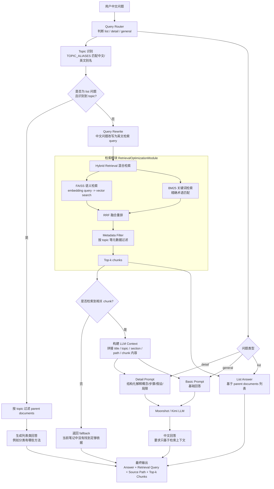

# RAG

## 项目架构
这个项目分成两条链路：离线知识库构建和在线问答。离线阶段先加载 Markdown，按标题结构切 chunk，保留 topic、section_path、relative_path 等元数据，然后用多语言 embedding 构建 FAISS 向量索引，同时用 chunks 初始化 BM25。在线阶段用户中文提问后，系统先做问题路由和 topic 识别，非列表问题会做中文到英文 query rewrite，然后同时走 FAISS 语义检索和 BM25 关键词检索，再用 RRF 融合重排，最后把 top-k chunk 拼成上下文交给 LLM 生成中文回答，并展示来源。

## 按标题结构切chunk并不够，你还做了什么操作？
我有考虑按标题切分后 chunk 过大的问题，所以没有直接相信标题切分一定合适。实现上先按 Markdown 标题切分，保留章节语义边界；如果某个标题块超过 1400 字符，就再用 RecursiveCharacterTextSplitter 按 1200 chunk size、150 overlap 递归切分。这样既尽量保留 Markdown 结构，又避免单个 chunk 太大影响 embedding 和检索质量。

## 为什么保存metadata？
我保存 metadata 是为了让检索结果可过滤、可追踪、可评估。比如 topic 用于主题过滤和列表问题，section_path 用于定位章节，relative_path 用于展示来源和离线评估，parent_id 用于从 child chunk 回溯到原始 Markdown。没有 metadata，系统只能返回一段文本，无法判断它来自哪里，也无法做 source accuracy 这种检索评估。

## 如何构建parent's id
我把每个原始 Markdown 文件作为一个 parent document。加载时读取完整文件内容，用相对路径生成稳定的 parent_id，并提取 title、topic、chapter、section_path 等 metadata。后续切 chunk 时，每个 child chunk 会继承这个 parent_id，所以检索到 chunk 后可以回溯到原始文档。列表类问题则直接基于 parent documents 按 topic 返回文档列表。

## 为什么多语言embedding？
是的，多语言 embedding 的一个重要原因是 Streamlit 在不开启 LLM rewrite 时会生成中英混合 retrieval query，需要 embedding 模型能同时理解中文和英文。但更根本的原因是这个项目本身就是中文问题检索英文资料，多语言 embedding 能提高中文、英文和中英混合 query 与英文 chunk 的语义对齐能力。BM25 主要依赖英文关键词，FAISS 则依赖多语言 embedding 来补足语义召回。

## 为什么用FAISS
我用 FAISS 是因为 RAG 需要先从知识库中召回和 query 语义最相关的 chunk。项目会把 Markdown 笔记切成 chunk，再用多语言 embedding 转成向量，FAISS 负责保存这些向量并做高效相似度检索。它比普通关键词搜索更适合处理中文问题检索英文文档这种语义匹配场景，也比直接遍历所有向量更高效。

## 为什么要做问题路由？
我做 query router 是为了让不同问题走不同处理路径。比如列表类问题更适合直接基于 topic metadata 返回 parent documents，而不是依赖向量检索，因为向量检索 top-k 可能漏掉部分算法。详细解释类问题则需要先 query rewrite，再 hybrid search，并使用 detail prompt 生成结构化回答。这样做可以提高召回完整性，也能让生成策略更贴合用户意图。

## 怎么实现topic识别的
topic 识别是为了判断用户问题属于哪个知识主题，用于列表类问题直接列文档，也用于检索时做 metadata filtering。在实现上，我没有用模型，而是维护了一个 TOPIC_ALIASES 字典，把中文表达和英文术语映射到标准 topic。系统会遍历 alias，如果用户问题包含“回归”“线性回归”“K-means”“PCA”等关键词，就返回对应的标准 topic。这个方案简单可控，但缺点是需要人工维护，遇到未覆盖的表达可能识别不到。
## query rewrite是怎么做的？
query rewrite 是为了缓解中文问题和英文知识库之间的语言错配。在 CLI 里，我用 LLM 根据 prompt 把中文问题改写成英文机器学习检索 query，比如把“线性回归怎么做变量选择”改成“linear regression variable selection feature selection p-value backward elimination”。在 Streamlit 里，为了支持没有 API key 的情况，我还做了本地 fallback rewrite，用手写词典把中文术语扩展成英文关键词。改写后的 query 再进入 FAISS 和 BM25 混合检索。

## 为什么要给streamlit加一个不需要llm rewrite的功能
Streamlit 里加“不启用 LLM rewrite”的选项，是为了让检索模块可以独立运行和调试。没有 API key 时，用户仍然能通过本地 fallback rewrite 查看检索结果；同时也能避免 LLM rewrite 带来的成本、延迟和改写偏移。这样 Streamlit 不只是最终问答界面，也可以作为 RAG 检索链路的调试工具。

## FAISS在项目中起什么作用
FAISS 在我的项目里负责语义检索。我先把英文 Markdown 笔记切成 chunk，再用多语言 embedding 模型把 chunk 转成向量，构建 FAISS index。用户中文问题会先被改写或向量化，然后通过 FAISS 找到语义最相近的英文笔记片段。因为 FAISS 擅长快速向量相似度搜索，所以它适合作为 RAG 的召回模块。

## 为什么同时走 FAISS 语义检索和 BM25 关键词检索？
我同时用了 FAISS 和 BM25，是因为机器学习笔记既有自然语言解释问题，也有很多精确术语。FAISS 适合语义检索，能处理中文问题和英文资料之间的语义匹配；BM25 适合关键词检索，对 PCA、K-means、p-value、OLS 这类术语更稳定。单独使用任何一种都容易漏召回，所以我用 hybrid search 同时召回，再用 RRF 做融合重排。
## 分别介绍下FAISS，BM25和RRF
FAISS 负责语义检索，解决中文问题和英文文档之间的语义匹配；BM25 负责关键词检索，补足 PCA、K-means、p-value 这类精确术语；RRF 负责把两路检索结果按排名融合，避免直接比较不同检索器的原始分数。最终这个 FAISS + BM25 + RRF 的组合就是我的 hybrid search。

## rrf怎么融合？
RRF 融合时，我没有直接比较 FAISS 和 BM25 的原始分数，因为它们分数尺度不同。我的做法是分别拿到 FAISS 和 BM25 的检索结果，然后根据每个 chunk 在各自列表中的排名计算 1 / (k + rank) 分数。如果同一个 chunk 同时被两路召回，它的分数会累加，因此排序更靠前。最后按 RRF 总分排序，得到 hybrid search 的最终 top-k。

## RRF中的k怎么理解
RRF 里的 k 是排名平滑参数。公式是 1 / (k + rank)，k 越小，排名靠前的结果优势越大；k 越大，不同名次之间的分数差异越平滑，也更鼓励多路检索共同命中的结果。我的项目里用了常见的 k=60，主要是为了避免 FAISS 或 BM25 某一路 top-1 过度主导，让同时被两路召回的 chunk 有机会排到更前面。

## 具体是怎么做的？
我的混合检索是两路召回加融合重排。初始化时我基于 FAISS vectorstore 创建一个语义 retriever，同时基于所有 chunks 创建 BM25 retriever。查询时，同一个 retrieval query 会同时进入 FAISS 和 BM25，各自返回 top-5 候选，然后用 RRF 根据排名融合两路结果。如果同一个 chunk 同时被两路召回，它的 RRF 分数会叠加，排序更靠前。最终返回融合后的 top-k chunks。带 topic 的情况是在 hybrid search 之后再做 metadata filter。

## 如何判断是否检索到相关chunk？
当前实现中，我是通过检索结果是否为空来判断是否找到相关 chunk。如果 hybrid search 或 metadata filtered search 返回空列表，就返回“当前笔记中没有找到足够依据”。但这个判断比较粗糙，因为它没有相关性阈值，只能说明有候选结果，不代表一定相关。更严谨的优化是保留 FAISS/BM25/RRF 分数，设置阈值，或者加入 reranker 判断 query 和 chunk 的真实相关性。

## 检索到之后你如何构建llm context？没检索到你又是怎么做的
检索到 top-k chunks 后，我会用 _build_context() 把每个 chunk 的 metadata 和正文拼起来。metadata 包括 title、topic、section_path 和 source path，这样 LLM 不只看到内容，也能知道来源。多个 chunk 之间用分隔线隔开，并且 basic/detail 两种回答会控制不同的最大 context 长度。如果没有检索到 chunk，系统不会调用 LLM，而是直接返回“当前笔记中没有找到足够依据”，避免模型在没有依据的情况下编造。

## streamlit是怎么实现的？
Streamlit 是这个项目的本地 Web UI，它主要把检索栈和生成栈串起来。启动时用 st.cache_resource 加载 Markdown、切 chunk、加载或构建 FAISS index，并初始化 hybrid retriever。页面左侧可以设置 top-k、是否调用 LLM 回答、是否启用 LLM query rewrite。用户输入中文问题后，系统先用规则判断 list/detail，再识别 topic。列表类问题直接按 topic 返回 parent documents；其他问题先做 LLM rewrite 或 fallback rewrite，再走 hybrid search，也就是 FAISS + BM25 + RRF。如果开启 LLM answer，就把 top-k chunks 传给 Kimi 生成中文回答；否则只展示 retrieval query 和来源 chunks，用于调试检索效果。

## evaluation 是怎么做的
我做了一个不调用 LLM 的离线检索评估脚本。每个 EvalCase 包含用户问题、固定 retrieval query、预期 topic 和预期 source path。评估时加载文档和 FAISS index，初始化 hybrid retriever，然后对每个 retrieval query 执行 FAISS + BM25 + RRF，统计 top-k 结果是否命中预期文件和主题。指标包括 Top-1 source accuracy、Top-k source accuracy 和 Top-k topic accuracy。这样可以把检索质量和 LLM 生成质量分开分析，目前结果说明主题召回较好，但 Top-1 精确排序还有优化空间。

## 后期evalution可以怎么更新？
后续 evaluation 我会分成检索端和生成端。检索端先标准化为 Hit@k 和 MRR@k，现在的 Top-k source accuracy 本质上就是 Source Hit@k，但 MRR 能进一步衡量正确文档排在第几位，更适合 RAG，因为排第一和排第五对生成影响很大。生成端可以考虑 RAGAS，但这个项目数据量小，直接引入 RAGAS 成本和统计意义都有限。我会先做小规模人工 reference answer 或 key points，再用轻量 LLM-as-judge 评估 faithfulness、relevance 和 completeness，等评估集扩大到 50-100 条后再考虑系统性接入 RAGAS。
## 为什么做这个项目
普通llm在特定领域回答时可能会回答的比较泛或者出现幻觉。加上我了解到很多大厂存在着使用rag的需求，因为有私有化数据，并且还要支持热更新。

我觉得rag这个项目既有实际用途，也涉及很多方面：文档分块、向量检索、关键词检索、混合排序、跨语言 query rewrite 和离线评估，能锻炼到ai应用工程能力
## 最大难点是什么

## Top-1 只有 40%，你怎么看？
Top-1 只有 40%，说明当前系统精确排序能力还不够，不能只看演示效果。但 Top-3 topic accuracy 有 93.3%，Top-3 source accuracy 有 73.3%，说明系统多数时候能召回正确主题和文件，只是排序不够好。所以我会把它看成 reranking 和 chunk 表示的问题，而不是整个检索链路失效。后续我会扩展评估集、强化 metadata 参与 embedding、优化 query rewrite，并加入 reranker 来提升 Top-1。
# AI coding+工程化

# 后端 + 计算机网络 + 数据库

# leetcode